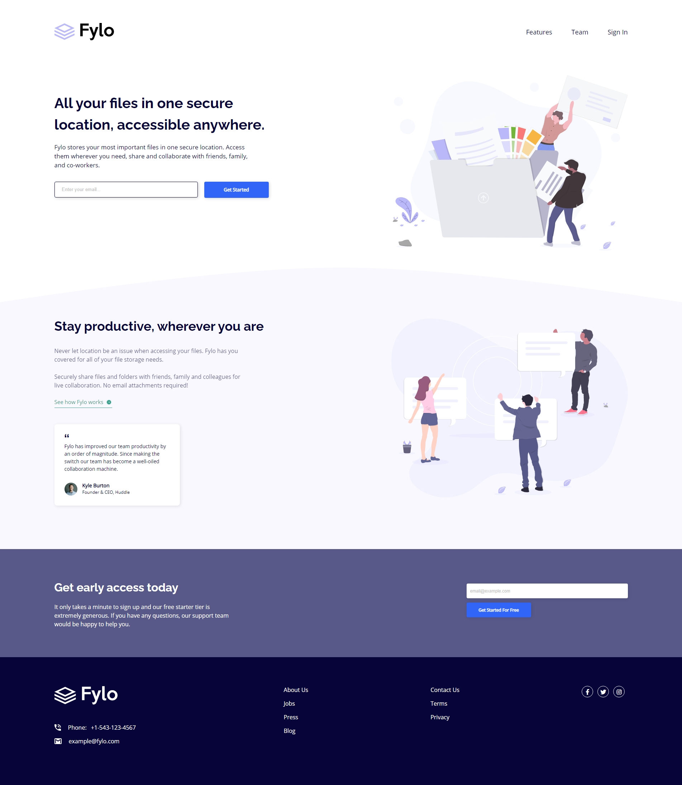
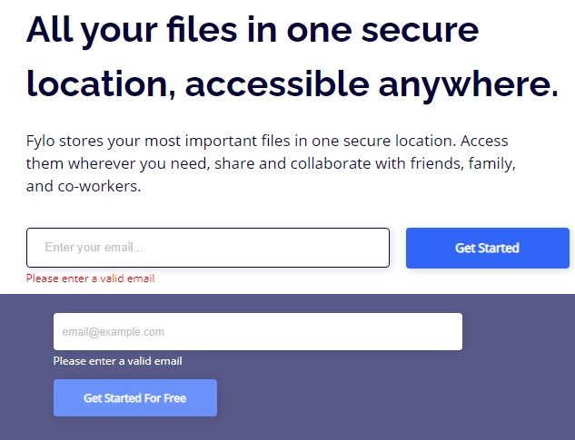
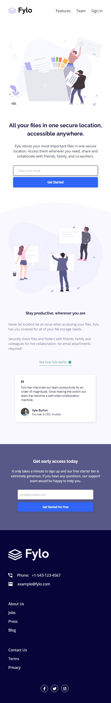
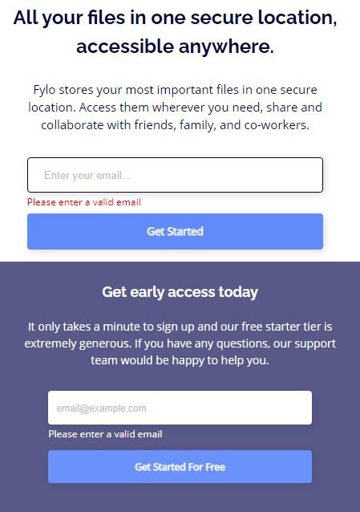

# Frontend Mentor - Fylo landing page with two column layout solution

This is a solution to the [Fylo landing page with two column layout challenge on Frontend Mentor](https://www.frontendmentor.io/challenges/fylo-landing-page-with-two-column-layout-5ca5ef041e82137ec91a50f5). Frontend Mentor challenges help you improve your coding skills by building realistic projects.

## Table of contents

- [Overview](#overview)
  - [The challenge](#the-challenge)
  - [Screenshot](#screenshot)
  - [Links](#links)
- [My process](#my-process)
  - [Built with](#built-with)
  - [What I learned](#what-i-learned)
- [Author](#author)

## Overview

### The challenge

Users should be able to:

- View the optimal layout for the site depending on their device's screen size
- See hover states for all interactive elements on the page

### Screenshot

### Links

- Live Site URL: https://fylo-landing-page-with-two-column-layout-phi.vercel.app/

## My process

### Built with

- HTML5
- Flexbox
- SCSS
- Mobile-first workflow
- JavaScript

### What I learned

In this project, I practiced SCSS by styling and laying out elements for a landing page. I learned how to use JavaScript DOM manipulation to display a message when the "Get Started" buttons were clicked. I used regex to validate the email in order to display a certain message for the different outcomes. Although validating emails on the cilent side is not recommended, I did it solely for the purpose of the UI/UX.

## Author

- Frontend Mentor - [@JacksonJ97](https://www.frontendmentor.io/profile/JacksonJ97)
